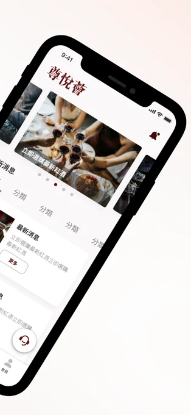
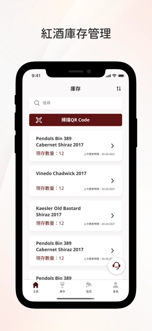
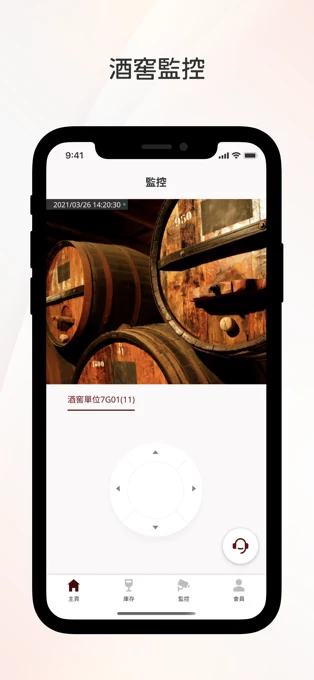
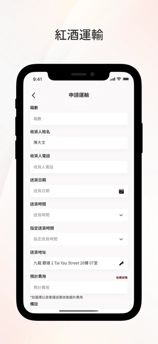
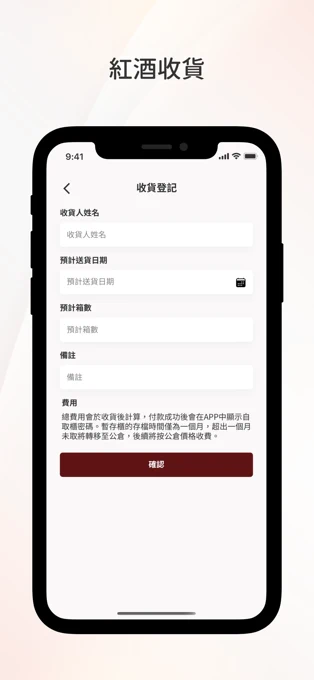
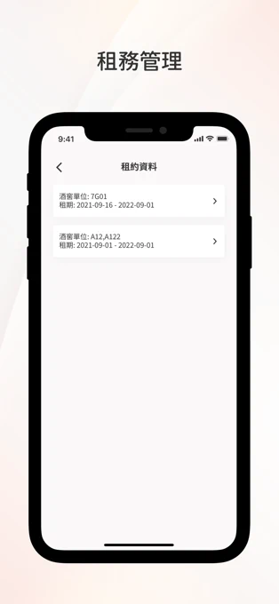

# CMHK Wine Management Mobile App

_This GitHub repository is private. Please contact oscarchankalung@gmail.com for access._

- **GitHub Repository**: https://github.com/oscarchankalung/cmhk-mobile-app
- **App Store**: https://apple.co/3t7dZrl
- **Google Play**: https://bit.ly/3t7unrT
- **Starting Date**: Project started at April 2021
- **Ending Date**: Project completed at December 2021. My contribution ended at September 2021
- **Tech Stacks**: React Native, Redux, Firebase

## Description

China Merchants Wine Cellar is a business that provides a constant temperature and humidity wine warehouse and HKQAA fine wine and commercial wine storage and management system. Dionysus Club is a one-stop service for information release, wine inventory management, wine cellar monitoring and electronic payment.

## Outcome

This project is completed and has dozens of downloads.

## Screenshots

  
  

