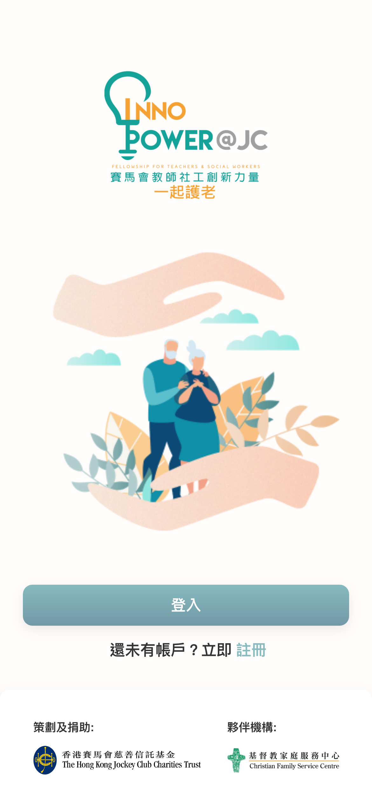
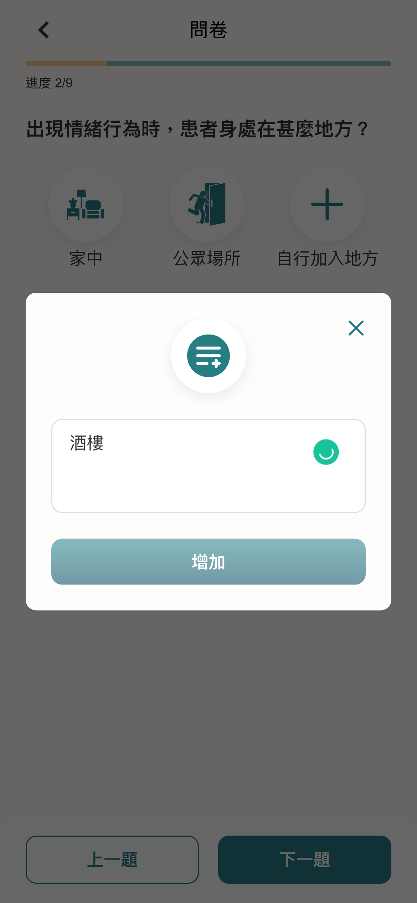
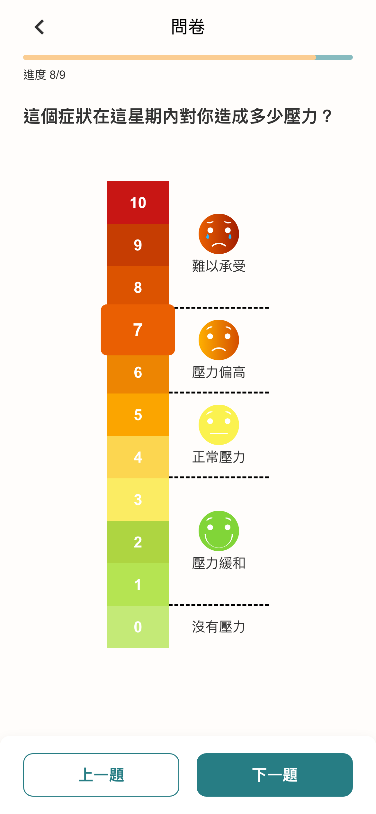
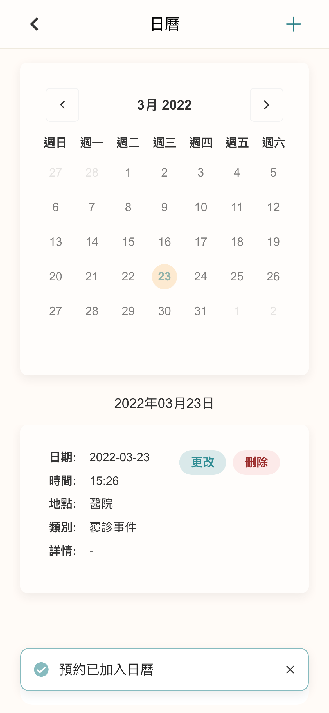

# Inno Power Elderly Service Mobile Web App

_This GitHub repository is private. Please contact oscarchankalung@gmail.com for access._

- **GitHub Repository**: https://github.com/oscarchankalung/inno-power-user-web
- **Website**: https://carer.cfsc.org.hk/auth
- **Starting Date**: Project started at August 2021
- **Ending Date**: Project ended at September 2021
- **Tech Stacks**: Angular, Ionic, Firebase

## Description

The [JC InnoPower: Fellowship for Teachers and Social Workers](https://jcinnopower.hk/en) is a talent development program that aims to build the innovative capacity of teachers and social workers in Hong Kong. The program encourages them to innovate in response to educational and social challenges, thereby contributing to the long-term development of these sectors.

This project is a mobile web app created for the carers of dementia patients. The app is an online platform that allows carers to record the behavioral and psychological symptoms of dementia, thereby discovering a pattern and facilitating care-taking. The carers can record a dementia outburst by answering a questionnaire and review the records. The information will be shared with the doctors for further analysis. The carers can also make an appointment with the doctors using the app.

## Outcome

This project was under UAT as I left the company. 90% of the frontend was finished for clients to review. It is expected the website would serve hundreds of users.

## Screenshots

 

 

 
