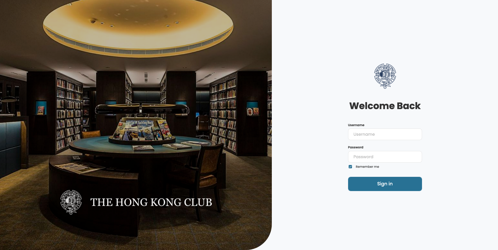
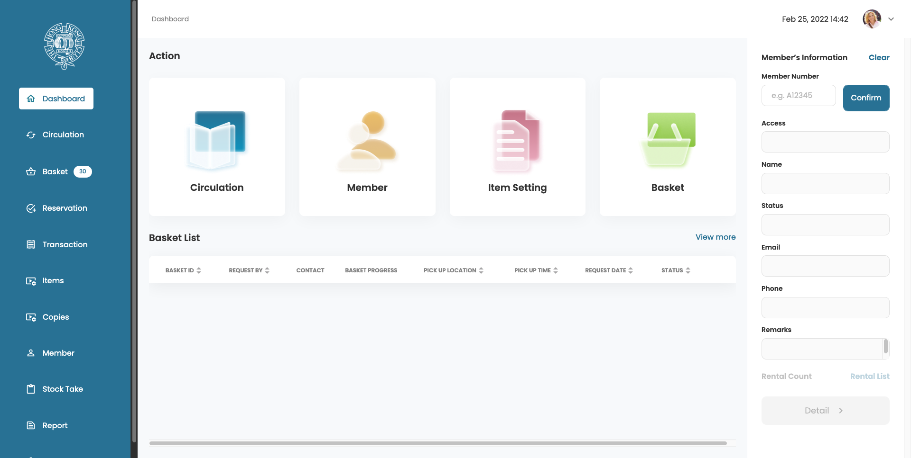
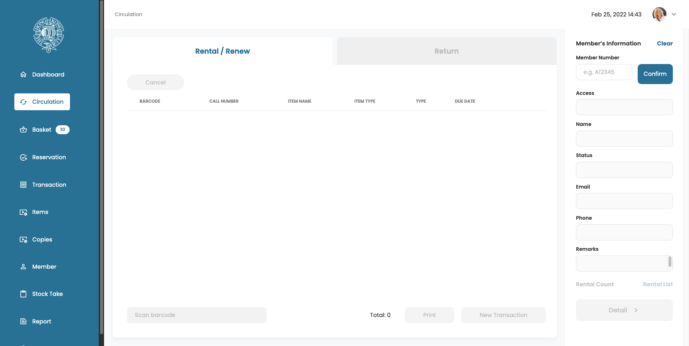
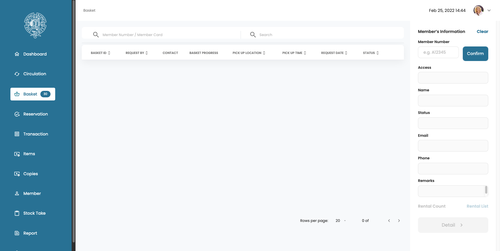
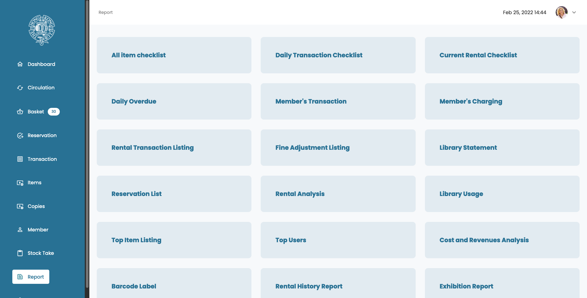

# The Hong Kong Club Library Admin Web App

_This GitHub repository is private. Please contact oscarchankalung@gmail.com for access._

- **GitHub Repository**: https://github.com/oscarchankalung/hkc-library-admin
- **Starting Date**: Project stared at November 2021
- **Ending Date**: My contribution ended at December 2021
- **Tech Stacks**: Angular, Bootstrap

## Description

[The Hong Kong Club](https://en.wikipedia.org/wiki/Hong_Kong_Club) is the first gentlemen's club in Hong Kong. It is a private business and dining club established by the British before the colonization. Its members were and are among the most influential people in the city (basically Illuminati).

[The Hong Kong Club Library](https://www.thehongkongclub.hk/public/library.html) contains over 5,200 books covering a wide range of subjects, over 13,000 DVDs and some 4,200 music CDs. The collection is separated into 5 categorizes: Movie, TV Series, CD, Book and Audio Book.

This project is a web app created for the administrators to manage the library services. Librarians can perform rental, renewal and return of materials for the members. They can view the basket, reservation and transaction history and manage the circulation and member profile.

## Outcome

70% of the frontend was finished as I left the company. It is expected the website would serve 3 to 5 users.

## Screenshots

