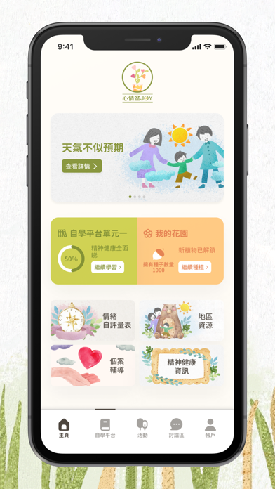
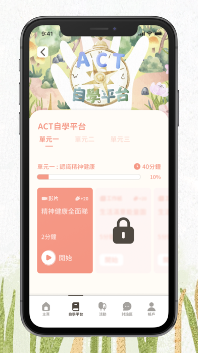
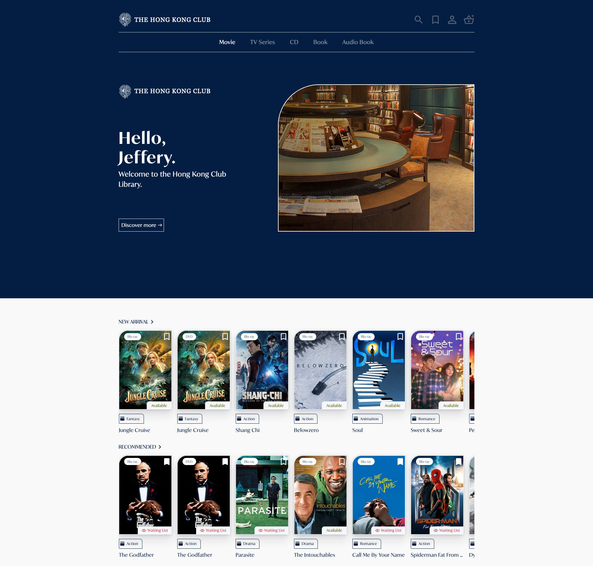

# Projects on AppicIDEA IT Solutions

_GitHub repositories of these projects are private. Please contact oscarchankalung@gmail.com for access._

- [01 CMHK Mobile App](#01-cmhk-mobile-app)
- [02 YYT Mobile App](#02-ytt-mobile-app)
- [03 CFSC Mental Health Mobile App](#03-cfsc-mental-health-mobile-app)
- [04 Innopower User Web](#04-inno-power-user-web)
- [05 HKC Library User](#05-hkc-library-user)
- [06 HKC Library Admin](#06-hkc-library-admin)

## 01 CMHK Mobile App

- **GitHub Repository**: https://github.com/oscarchankalung/cmhk-mobile-app
- **App Store**: https://apple.co/3t7dZrl
- **Google Play**: https://bit.ly/3t7unrT
- **Starting Date**: Project started at April 2021
- **Ending Date**: Project completed at December 2021. My contribution ended at September 2021
- **Tech Stacks**: React Native, Redux, Firebase

A one-stop service for information release, wine inventory management, wine cellar monitoring and electronic payment. Learn more [here](./01-cmhk-mobile-app/README.md).

 

## 02 YYT Mobile App

- **GitHub Repository**: https://github.com/oscarchankalung/yyt-mobile-app
- **Starting Date**: Project started at May 2021
- **Ending Date**: My contribution ended at September 2021
- **Tech Stacks**: React Native, Redux, Firebase

A mobile app that incorporates the offline and online shopping experience, while providing a new loyalty program. Learn more [here](./02-yyt-mobile-app/README.md).

## 03 CFSC Mental Health Mobile App

- **GitHub Repository**: https://github.com/oscarchankalung/cfsc-mental-health-mobile-app
- **App Store**: https://apple.co/3o8RYHm
- **Google Play**: https://bit.ly/3d6Wfop
- **Starting Date**: Project started at May 2021. My contribution started at July 2021.
- **Ending Date**: Project completed at November 2021. My contribution ended at August 2021.
- **Tech Stacks**: React Native, Redux, Firebase

A mobile app created for parents to improve their emotional and mental health through animations and videos. Learn more [here](./03-cfsc-mental-health-mobile-app/README.md).

 

## 04 Innopower User Web

- **GitHub Repository**: https://github.com/oscarchankalung/inno-power-user-web
- **Website**: https://carer.cfsc.org.hk/auth
- **Starting Date**: Project started at August 2021
- **Ending Date**: Project ended at September 2021
- **Tech Stacks**: Angular, Ionic, Firebase

A mobile web app created for the carers of dementia patients to record the behavioral and psychological symptoms. Learn more [here](./04-inno-power-user-web/README.md).

 

## 05 HKC Library User

- **GitHub Repository**: https://github.com/oscarchankalung/hkc-library-user
- **Starting Date**: Project started at October 2021
- **Ending Date**: My contribution ended at November 2021
- **Tech Stacks**: Angular, Bootstrap

A web app created for the Hong Kong Club members to access the library service. Learn more [here](./05-hkc-library-user/README.md).

## 06 HKC Library Admin

- **GitHub Repository**: https://github.com/oscarchankalung/hkc-library-admin
- **Starting Date**: Project stared at November 2021
- **Ending Date**: My contribution ended at December 2021
- **Tech Stacks**: Angular, Bootstrap

A web app created for the administrators to manage the library services. Learn more [here](./06-hkc-library-admin/README.md).

