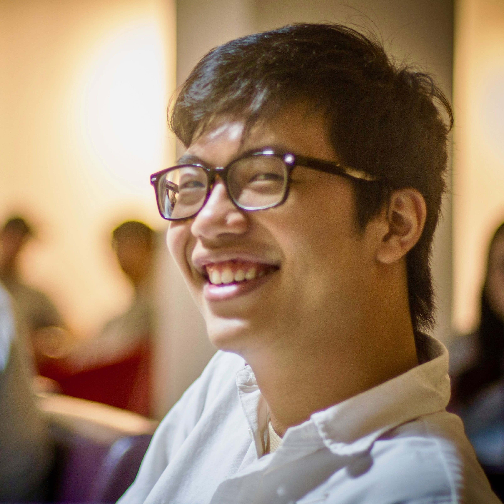

# About

* [navbar](#navbar)
* [photo](#photo)
* [statement](#statement)
* [update](#update)
* [contact](#contact)

## navbar

* About 關於
* Portfolio 履歷
* Projects 專案
* Gallery 相簿

## photo

    

## statement

Hello, I'm Oscar Chan.

I’m a self-taught programmer switching careers into web development. As a technical business analyst in Macquarie, I successfully adopted new technologies such as Alteryx to drive office automation, saving 1200 working hours annually.  I've taken various programming courses and worked in a full development life cycle. Now, I am seeking new challenges in a more technical and flexible environment.

你好，我是陳嘉隆。

我是一位自學成才的程序員，正轉行做網絡開發。作為Macquarie的技術業務分析員，我成功採用了Alteryx等新技術來推動辦公自動化，每年節省1200個工作小時。我參加過各種編程課程，並參與過完整的軟件生命週期。我現正尋求新的挑戰，希望在技術性和靈活性更高的環境中工作。

## update

**Latest update (2020-09-02)**

Learning web development through [freeCodeCamp](https://www.freecodecamp.org/), [MDN Learn web development](https://developer.mozilla.org/en-US/docs/Learn) and [Web Developer Roadmap](https://roadmap.sh/frontend).

**最新消息（2020年9月2日）**

正在[freeCodeCamp](https://www.freecodecamp.org/)、[MDN Learn web development](https://developer.mozilla.org/en-US/docs/Learn)及[Web Developer Roadmap](https://roadmap.sh/frontend)上學習網絡開發。

## contact

* [GitHub](https://github.com/oscarchankalung) github.com/oscarchankalung `<i class="fab fa-github"></i>`
* [LinkedIn](https://www.linkedin.com/in/oscarchankalung/) linkedin.com/in/oscarchankalung `<i class="fab fa-linkedin-in"></i>`
* [Email](emailto:oscarchankalung@gmail.com) oscarchankalung@gmail.com `<i class="far fa-envelope"></i>`
